# Laboratorio SHH-Ingesoft II

## Esteban Prieto Lugo

### Paso a Paso del Laboratorio

1.  Nos ubicamos en la carpeta donde están los archivos y creamos un servidor.

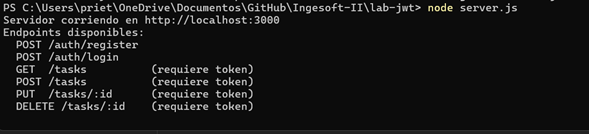

2.  Abrimos una segunda pestaña de Powershell y nos dirigimos de nuevo a la misma carpeta donde están los archivos, luego hacemos el registro del usuario.

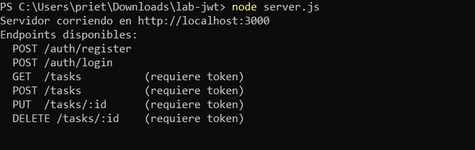

3.  Al hacer el login nos devuelve nuestro token.

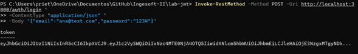

4.  Guardamos el token y verificamos que se halla guardado con éxito.

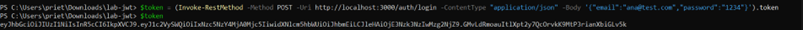

5.  Intentamos hacer un GET sin token y nos debe salir error 401 al intentarlo.

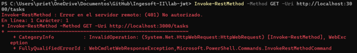

6.  Ahora realizamos el GET con el token.

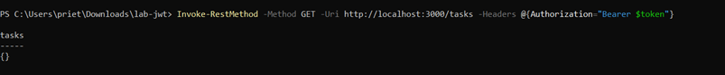

7.  Creamos una nueva tarea.

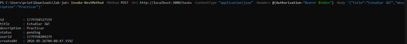

8.  Y ahora creamos otra tarea para luego hacer PUT y DELETE.

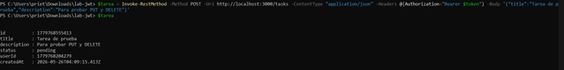

9.  Actualizamos con PUT.

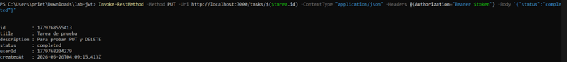

10. Ahora lo borramos con DELETE

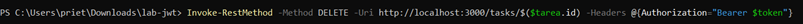

11. Ahora en Windows vamos a **"Configuración\>Sistema\>Características Opcionales\>Ver características\>"**. Buscamos en características disponibles por Servidor OpenSSH.

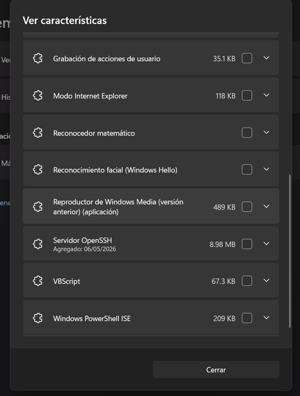

12. Abrimos otro Powershell en Admin para iniciar SSH

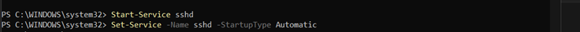

13. Abrimos Firewall SSH

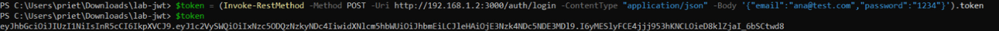

14. Verificamos que esté corriendo

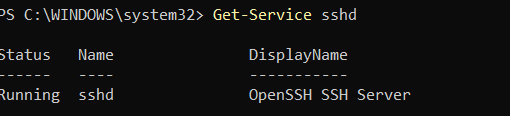

15. Creamos un usuario local y le damos permisos

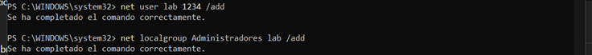

16. Desde una segunda PC nos conectamos a la PC1 con el usuario y la IP de esta y usamos la contraseña

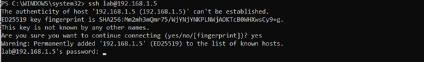

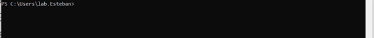

17. Desde la PC1 copiamos el token y lo guardamos en la PC2, y usamos el GET con token.

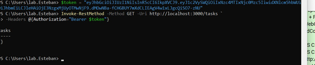
